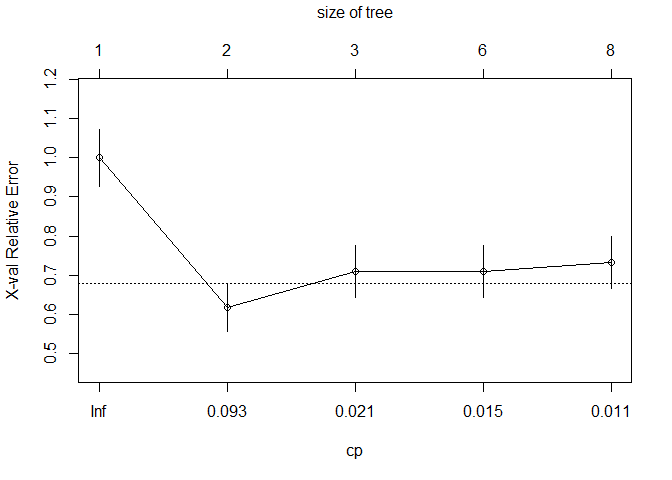

Loan Prediction
================

Loan Prediction Problem
-----------------------

### Problem Statement

#### About Company

Dream Housing Finance company deals in all home loans. They have presence across all urban, semi urban and rural areas. Customer first apply for home loan after that company validates the customer eligibility for loan.

#### Problem

Company wants to automate the loan eligibility process (real time) based on customer detail provided while filling online application form. These details are Gender, Marital Status, Education, Number of Dependents, Income, Loan Amount, Credit History and others. To automate this process, they have given a problem to identify the customers' segments, those are eligible for loan amount so that they can specifically target these customers. Here they have provided a partial data set.

### Data


### Structured Analysis Planning

The first thing we need to do and before jumping to analyze the data is to understand the problem statement and create a S.M.A.R.T objective. The next step is to identify our independent variables and our dependent variable. The below mind map illustrates the process I have conducted to structure plan the project.


### Checking the data

The next step is to look at the data we're working with. Realistically, most of the data we will get, even from the government, can have errors, and it's important to identify these errors before spending time analyzing the data. Normally, we must answer the following questions:

o Do we find something wrong in the data?

o Are there ambiguous variables in the dataset?

o Are there variables that should be fixed or removed?

Let's start by reading the data using the function read.csv() and show the first part of the dataset:

``` r
#setwd("C:/Users/USER/Desktop/Coaching/Projects/Loan Prediction")
tr <- read.csv('train.csv', header = TRUE)
head(tr)
```

    ##    Loan_ID Gender Married Dependents    Education Self_Employed
    ## 1 LP001002   Male      No          0     Graduate            No
    ## 2 LP001003   Male     Yes          1     Graduate            No
    ## 3 LP001005   Male     Yes          0     Graduate           Yes
    ## 4 LP001006   Male     Yes          0 Not Graduate            No
    ## 5 LP001008   Male      No          0     Graduate            No
    ## 6 LP001011   Male     Yes          2     Graduate           Yes
    ##   ApplicantIncome CoapplicantIncome LoanAmount Loan_Amount_Term
    ## 1            5849                 0         NA              360
    ## 2            4583              1508        128              360
    ## 3            3000                 0         66              360
    ## 4            2583              2358        120              360
    ## 5            6000                 0        141              360
    ## 6            5417              4196        267              360
    ##   Credit_History Property_Area Loan_Status
    ## 1              1         Urban           Y
    ## 2              1         Rural           N
    ## 3              1         Urban           Y
    ## 4              1         Urban           Y
    ## 5              1         Urban           Y
    ## 6              1         Urban           Y

The first row in the dataset defines the column header. Each of these headers is described in the above table. Now, we will run the summary function to have a quick look on the stats:

``` r
summary(tr)
```

    ##      Loan_ID       Gender    Married   Dependents        Education  
    ##  LP001002:  1         : 13      :  3     : 15     Graduate    :480  
    ##  LP001003:  1   Female:112   No :213   0 :345     Not Graduate:134  
    ##  LP001005:  1   Male  :489   Yes:398   1 :102                       
    ##  LP001006:  1                          2 :101                       
    ##  LP001008:  1                          3+: 51                       
    ##  LP001011:  1                                                       
    ##  (Other) :608                                                       
    ##  Self_Employed ApplicantIncome CoapplicantIncome   LoanAmount   
    ##     : 32       Min.   :  150   Min.   :    0     Min.   :  9.0  
    ##  No :500       1st Qu.: 2878   1st Qu.:    0     1st Qu.:100.0  
    ##  Yes: 82       Median : 3812   Median : 1188     Median :128.0  
    ##                Mean   : 5403   Mean   : 1621     Mean   :146.4  
    ##                3rd Qu.: 5795   3rd Qu.: 2297     3rd Qu.:168.0  
    ##                Max.   :81000   Max.   :41667     Max.   :700.0  
    ##                                                  NA's   :22     
    ##  Loan_Amount_Term Credit_History     Property_Area Loan_Status
    ##  Min.   : 12      Min.   :0.0000   Rural    :179   N:192      
    ##  1st Qu.:360      1st Qu.:1.0000   Semiurban:233   Y:422      
    ##  Median :360      Median :1.0000   Urban    :202              
    ##  Mean   :342      Mean   :0.8422                              
    ##  3rd Qu.:360      3rd Qu.:1.0000                              
    ##  Max.   :480      Max.   :1.0000                              
    ##  NA's   :14       NA's   :50

Below are few conclusions we can infer by looking at the output: There are (+) sign on 51 record

The mean of Credit\_history variable is 0.8422. That's weird knowing that this variable has value of 1 for customers who have credit history and 0 otherwise.

There are blank fields in Gender, Married, Dependents and Self\_Employed.

There are NAs in LoanAmount, Loan\_Amount\_term and Credit\_History.

Let's do now a quick fix on some of the variables:

``` r
setwd("C:/Users/USER/Desktop/Coaching/Projects/Loan Prediction")
tr <- read.csv(file="train.csv", na.strings=c("", "NA"), header=TRUE) 
library(plyr)
tr$Dependents <- revalue(tr$Dependents, c("3+"="3"))
```

Now, let's have a closer look at the missing data:

    ##           Loan_ID            Gender           Married        Dependents 
    ##                 0                13                 3                15 
    ##         Education     Self_Employed   ApplicantIncome CoapplicantIncome 
    ##                 0                32                 0                 0 
    ##        LoanAmount  Loan_Amount_Term    Credit_History     Property_Area 
    ##                22                14                50                 0 
    ##       Loan_Status 
    ##                 0

    ## Loading required package: colorspace

    ## Loading required package: grid

    ## Loading required package: data.table

    ## VIM is ready to use. 
    ##  Since version 4.0.0 the GUI is in its own package VIMGUI.
    ## 
    ##           Please use the package to use the new (and old) GUI.

    ## Suggestions and bug-reports can be submitted at: https://github.com/alexkowa/VIM/issues

    ## 
    ## Attaching package: 'VIM'

    ## The following object is masked from 'package:datasets':
    ## 
    ##     sleep


    ## 
    ##  Variables sorted by number of missings: 
    ##           Variable       Count
    ##     Credit_History 0.081433225
    ##      Self_Employed 0.052117264
    ##         LoanAmount 0.035830619
    ##         Dependents 0.024429967
    ##   Loan_Amount_Term 0.022801303
    ##             Gender 0.021172638
    ##            Married 0.004885993
    ##            Loan_ID 0.000000000
    ##          Education 0.000000000
    ##    ApplicantIncome 0.000000000
    ##  CoapplicantIncome 0.000000000
    ##      Property_Area 0.000000000
    ##        Loan_Status 0.000000000

From the chart and the table, there are seven variables that have missing data. Now, it's the time to give a look at the distribution of the data. We will start with the numerical variables: Loan Amount and ApplicantIncome: Below are the histograms and the boxplots of the loan amount and the applicant income variables: 

    ## null device 
    ##           1

Here we notice that there are few extreme values in both variables. Let's also examine if the applicant' loan amounts distribution is affected by their educational level:

    ## Warning in data(tr, package = "lattice"): data set 'tr' not found

    ## Warning: Removed 22 rows containing non-finite values (stat_density).

 We note that graduates have more outliers and their loan amount distribution is wider. Now let's give a look at the categorical variables in the dataset: 

    ## null device 
    ##           1

If we look at the Gender graph, we note that males have more records and more than half of the applicants' applications have been approved. There are less female applicants but still more than half of their applications have been approved. We look at the other charts with the same eye to evaluate how each category performed in regards to the approval of the loan applications.

### Tidying the data

Now that we've identified several errors in the data set, we need to fix them before we continue with our analysis. Let's review the issues:

There are missing values in some variables. Based on the importance of the variables, we will decide on the method to use.

Looking at the distributions of the data, we noticed that ApplicantIncome and LoanAmount have outliers.

Fixing outliers can be tricky. It's hard to tell if they were caused by measurement error, errors while recording, or if the outliers are real anomaly. If we decide to remove records, we have to document the reason behind this decision.

In this data set, we will assume that missing values are systematic because the missing data are coming in certain variables in a random manner. Also, we note that missing values are on both numerical and categorical data, therefore, we will be using the mice package in R. This package helps in imputing missing values with plausible data values. These values are inferred from a distribution that is designed for each missing data point. In the missing data plot above, we note that 0.78 of the data are not missing any information, 0.07 are missing the Credit\_History value, and the remaining ones show other missing patterns.

The mice() function takes care of the imputing process:

    ## 
    ##  iter imp variable
    ##   1   1  Gender  Married  Dependents  Self_Employed  LoanAmount  Loan_Amount_Term  Credit_History
    ##   1   2  Gender  Married  Dependents  Self_Employed  LoanAmount  Loan_Amount_Term  Credit_History
    ##   2   1  Gender  Married  Dependents  Self_Employed  LoanAmount  Loan_Amount_Term  Credit_History
    ##   2   2  Gender  Married  Dependents  Self_Employed  LoanAmount  Loan_Amount_Term  Credit_History

It's important to mention that mice stands for multiple imputation by chained equations. The 'm' argument in the function indicates how many rounds of imputation we want to do. For simplicity, I will choose 2. The 'method' argument indicates which of the many methods for imputations we want to use. I chose CART which stands for classification and regression trees. This method work with all variables types, and that's why I chose it. Now let's merge the imputed data into our original dataset. We can do this by using the complete() function:

``` r
tr <- complete(imputed_Data,2) #here I chose the second round of data imputation
```

Check missing data again, we note that there is no missing data after the imputation:

``` r
sapply(tr, function(x) sum(is.na(x)))
```

    ##           Loan_ID            Gender           Married        Dependents 
    ##                 0                 0                 0                 0 
    ##         Education     Self_Employed   ApplicantIncome CoapplicantIncome 
    ##                 0                 0                 0                 0 
    ##        LoanAmount  Loan_Amount_Term    Credit_History     Property_Area 
    ##                 0                 0                 0                 0 
    ##       Loan_Status 
    ##                 0

It's time to treat the extreme values. Looking at the LoanAmount variable, we guess that extreme values are possible as some customers, for some reason, may want to apply for higher loan amounts. We will perform the log transformation to normalize the data: 

    ## null device 
    ##           1

Now the distribution looks closer to normal and effect of extreme values has significantly subsided.

Coming to ApplicantIncome, it will be a good idea to combine both ApplicantIncome and Co-applicants as total income and then perform log transformation of the combined variable.

we will use the CART imputation method. If we know that the values for a measurement fall in a certain range, we can fill in empty values with the average of that measurement. 

    ## null device 
    ##           1

We see that the distribution is better and closer to a normal distribution.

### Building Predictive Models

Now it's the time to make the next big step in our analysis which is splitting the data into training and test sets.

A training set is the subset of the data that we use to train our models but the test set is a random subset of the data which are derived from the training set. We will use the test set to validate our models as un-foreseen data.

In a sparse data like ours, it's easy to overfit the data. Overfit in simple terms means that the model will learn the training set that it won't be able to handle most of the cases it has never seen before. Therefore, we are going to score the data using our test set. Once we split the data, we will treat the testing set like it no longer exists. Let's split the data:

``` r
set.seed(42)
sample <- sample.int(n = nrow(tr), size = floor(.70*nrow(tr)), replace = F)
trainnew <- tr[sample, ]
testnew  <- tr[-sample, ]
```

#### Logistic Regression

We will now start with our first logistic regression model. We will not take all the variables in the model because this might cause an overfitting of the data. To choose our variables, let's examine the importance of the variables logically. The chances that an applicant's application would be approved is higher if:

Applicants took a loan before. Credit history is the variable which answers that.

Applicants with higher incomes. So, we might look at the income variable which we created.

Applicants with higher education.

Applicants who have stable jobs.

We will use Credit\_History variable in our first logistic regression model.

    ## Error in summary(logistic1): object 'logistic1' not found

    ## Error in predict(logistic1, newdata = trainnew, type = "response"): object 'logistic1' not found

    ## Error in table(trainnew$Loan_Status, my_prediction_tr1 > 0.5): object 'my_prediction_tr1' not found

    ## 
    ## Call:
    ## glm(formula = Loan_Status ~ Credit_History, family = binomial, 
    ##     data = testnew)
    ## 
    ## Deviance Residuals: 
    ##     Min       1Q   Median       3Q      Max  
    ## -1.8051  -0.2520   0.6607   0.6607   2.6328  
    ## 
    ## Coefficients:
    ##                Estimate Std. Error z value Pr(>|z|)    
    ## (Intercept)      -3.434      1.016  -3.380 0.000725 ***
    ## Credit_History    4.845      1.036   4.676 2.93e-06 ***
    ## ---
    ## Signif. codes:  0 '***' 0.001 '**' 0.01 '*' 0.05 '.' 0.1 ' ' 1
    ## 
    ## (Dispersion parameter for binomial family taken to be 1)
    ## 
    ##     Null deviance: 234.58  on 184  degrees of freedom
    ## Residual deviance: 160.34  on 183  degrees of freedom
    ## AIC: 164.34
    ## 
    ## Number of Fisher Scoring iterations: 6

    ##    
    ##     FALSE TRUE
    ##   N    31   30
    ##   Y     1  123

Logistic Regression, in simple terms, predicts the probability of occurrence of an event by fitting data to a logit function. Regression coefficients represent the mean change in the response variable for one unit of change in the predictor variable while holding other predictors in the model constant. This type of models is part of a larger class of algorithms known as Generalized Linear Model or GLM. The equation of logistic regression is:


The role of the link function is to link the expectation of 'y' to the linear predictor. Logistic regression has the following assumptions:

GLM does not assume a linear relationship between dependent and independent variables.

Dependent variable need not to be normally distributed.

It uses maximum likelihood estimation (MLE).

Errors need to be independent but not normally distributed.

In the output, the first thing we see is the call, this is R reminding us about the model we have run. Next, we see the deviance residuals which are the measures of the model fit. This part shows the distribution of the deviance residuals for individual cases used in the model. The next part shows the coefficients, their standard errors, the z-statistic, and the associated p-value. The p-value for each term tests the null hypothesis that the coefficient is equal to zero (no effect). A low p-value (&lt; 0.05) indicates that we can reject the null hypothesis and the predictor is meaningful to the model. Conversely, a larger p-value indicates that changes in the predictor are not associated with changes in the dependent variable and that it's insignificant. The p-value for the Credit\_History is so small and therefore, it's significant.

We have also generated a confusion table to check the accuracy of the model on both the train and the test data:

Train data: 81.12% Test data: 83.24%

Let's add other variables and check the accuracy:

    ## 
    ## Call:
    ## glm(formula = Loan_Status ~ Credit_History + Education + Self_Employed + 
    ##     Property_Area + LogLoanAmount + LogIncome, family = binomial, 
    ##     data = trainnew)
    ## 
    ## Deviance Residuals: 
    ##     Min       1Q   Median       3Q      Max  
    ## -2.3203  -0.4114   0.5504   0.6895   2.2706  
    ## 
    ## Coefficients:
    ##                Estimate Std. Error z value Pr(>|z|)    
    ## (Intercept)     -2.5647     2.2809  -1.124   0.2608    
    ## Credit_History   3.6209     0.4579   7.907 2.64e-15 ***
    ## Education2      -0.7175     0.3073  -2.335   0.0195 *  
    ## Self_Employed2   0.1554     0.3772   0.412   0.6804    
    ## Property_Area2   0.8430     0.3126   2.697   0.0070 ** 
    ## Property_Area3   0.4496     0.3088   1.456   0.1454    
    ## LogLoanAmount   -0.7932     0.3980  -1.993   0.0462 *  
    ## LogIncome        0.4506     0.3503   1.286   0.1983    
    ## ---
    ## Signif. codes:  0 '***' 0.001 '**' 0.01 '*' 0.05 '.' 0.1 ' ' 1
    ## 
    ## (Dispersion parameter for binomial family taken to be 1)
    ## 
    ##     Null deviance: 527.96  on 428  degrees of freedom
    ## Residual deviance: 393.03  on 421  degrees of freedom
    ## AIC: 409.03
    ## 
    ## Number of Fisher Scoring iterations: 5

    ## Warning: contrasts dropped from factor Education

    ## Warning: contrasts dropped from factor Self_Employed

    ## Warning: contrasts dropped from factor Property_Area

    ##    
    ##     FALSE TRUE
    ##   N    56   75
    ##   Y     6  292

    ## 
    ## Call:
    ## glm(formula = Loan_Status ~ Credit_History + Education + Self_Employed + 
    ##     Property_Area + LogLoanAmount + LogIncome, family = binomial, 
    ##     data = testnew)
    ## 
    ## Deviance Residuals: 
    ##     Min       1Q   Median       3Q      Max  
    ## -2.3315  -0.1622   0.4021   0.7359   2.9630  
    ## 
    ## Coefficients:
    ##                Estimate Std. Error z value Pr(>|z|)    
    ## (Intercept)    -4.80883    3.28784  -1.463   0.1436    
    ## Credit_History  5.38627    1.10039   4.895 9.84e-07 ***
    ## Education2      0.56115    0.53224   1.054   0.2917    
    ## Self_Employed2 -0.35871    0.60503  -0.593   0.5533    
    ## Property_Area2  1.48356    0.59642   2.487   0.0129 *  
    ## Property_Area3 -0.07527    0.48996  -0.154   0.8779    
    ## LogLoanAmount   0.45786    0.42743   1.071   0.2841    
    ## LogIncome      -0.21141    0.44259  -0.478   0.6329    
    ## ---
    ## Signif. codes:  0 '***' 0.001 '**' 0.01 '*' 0.05 '.' 0.1 ' ' 1
    ## 
    ## (Dispersion parameter for binomial family taken to be 1)
    ## 
    ##     Null deviance: 234.58  on 184  degrees of freedom
    ## Residual deviance: 146.35  on 177  degrees of freedom
    ## AIC: 162.35
    ## 
    ## Number of Fisher Scoring iterations: 6

    ## Warning: contrasts dropped from factor Education

    ## Warning: contrasts dropped from factor Self_Employed

    ## Warning: contrasts dropped from factor Property_Area

    ##    
    ##     FALSE TRUE
    ##   N    32   29
    ##   Y     1  123

Train data: 81.11% Test data: 83.78% We note that adding variables improved the accuracy of the test set.

#### Decision Tree

Decision trees create a set of binary splits on the predictor variables in order to create a tree that can be used to classify new observations into one of two groups. Here, we will be using classical trees. The algorithm of this model is the following:

Choose the predictor variable that best splits the data into two groups;

Separate the data into these two groups;

Repeat these steps until a subgroup contains fewer than a minimum number of observations;

To classify a case, run it down the tree to a terminal node, and assign it the model outcome value assigned in the previous step.

``` r
library(rpart)
# grow tree 
dtree <- rpart(Loan_Status ~ Credit_History+Education+Self_Employed+Property_Area+LogLoanAmount+
                 LogIncome,method="class", data=trainnew,parms=list(split="information"))
dtree$cptable
```

    ##           CP nsplit rel error    xerror       xstd
    ## 1 0.38167939      0 1.0000000 1.0000000 0.07281885
    ## 2 0.02290076      1 0.6183206 0.6183206 0.06187742
    ## 3 0.01908397      2 0.5954198 0.7099237 0.06514951
    ## 4 0.01145038      5 0.5343511 0.7099237 0.06514951
    ## 5 0.01000000      7 0.5114504 0.7328244 0.06589581

``` r
plotcp(dtree)
```



``` r
dtree.pruned <- prune(dtree, cp=.02290076)
library(rpart.plot)
prp(dtree.pruned, type = 2, extra = 104,
    fallen.leaves = TRUE, main="Decision Tree")
```


``` r
dtree.pred <- predict(dtree.pruned, trainnew, type="class")
```

    ## Warning: contrasts dropped from factor Education

    ## Warning: contrasts dropped from factor Self_Employed

    ## Warning: contrasts dropped from factor Property_Area

``` r
dtree.perf <- table(trainnew$Loan_Status, dtree.pred,
                    dnn=c("Actual", "Predicted"))
dtree.perf
```

    ##       Predicted
    ## Actual   N   Y
    ##      N  62  69
    ##      Y   9 289

In R, decision trees can be grown and pruned using the rpart() function and prune() function in the rpart package. First, the tree is grown using the rpart() function. We printed the tree and the summary to examine the fitted model. The tree may be too large and need to be pruned. To choose a final tree size, examine the cptable of the list returned by rpart(). It contains data about the prediction error for different tree sizes. The complexity parameter (cp) is used to penalize larger trees. Tree size is defined by the number of branch splits (nsplit). A tree with n splits has n + 1 terminal nodes. The (rel error) contains the error rate for a tree of a given size in the training sample. The cross-validated error (xerror) is based on 10-fold cross validation, using the training sample. The (xstd) contains the standard error of the cross-validation error.

The plotcp() function plots the cross-validated error against the complexity parameter. To choose the final tree size, we need to choose the smallest tree whose cross-validated error is within one standard error of the minimum cross-validated error value. In our case, the minimum cross-validated error is 0.618 with a standard error of 0.0618. So, the smallest tree with a cross-validated error is within 0.618 ± 0.0618 that is between 0.56 and 0.68 is selected. From the table, a tree with one splits (cross-validated error = 0.618) fits the requirement.

From the cptable, a tree with one splits has a complexity parameter of 0.02290076, so the statement prune(dtree, cp=0.2290076) returns a tree with the desired size. We have then plotted the tree: pruned tree for predicting the loan status. We look at the tree at the top moving left if a condition is true or right otherwise. When an observation hits a terminal node, it's classified. Each node contains the probability of the classes in that node, along with percentage of the sample.

Finally, we ran the confusion table to know the accuracy of the model. PS: We followed the same steps in the test data.

``` r
dtree_test <- rpart(Loan_Status ~ Credit_History+Education+Self_Employed+Property_Area+LogLoanAmount+
                 LogIncome,method="class", data=testnew,parms=list(split="information"))
dtree_test$cptable
```

    ##           CP nsplit rel error    xerror       xstd
    ## 1 0.49180328      0 1.0000000 1.0000000 0.10482384
    ## 2 0.01639344      1 0.5081967 0.5081967 0.08327708
    ## 3 0.01000000      5 0.4426230 0.6393443 0.09094797

``` r
plotcp(dtree_test)
```


``` r
dtree_test.pruned <- prune(dtree_test, cp=.01639344)
prp(dtree_test.pruned, type = 2, extra = 104,
    fallen.leaves = TRUE, main="Decision Tree")
```


``` r
dtree_test.pred <- predict(dtree_test.pruned, testnew, type="class")
```

    ## Warning: contrasts dropped from factor Education

    ## Warning: contrasts dropped from factor Self_Employed

    ## Warning: contrasts dropped from factor Property_Area

``` r
dtree_test.perf <- table(testnew$Loan_Status, dtree_test.pred,
                    dnn=c("Actual", "Predicted"))
dtree_test.perf
```

    ##       Predicted
    ## Actual   N   Y
    ##      N  42  19
    ##      Y   8 116

Accuracy: Train data: 81.81% Test data: 85.4% Results show better performance than the logistic model.

#### Random Forest

A random forest is an ensemble learning approach to supervised learning. This approach develops multiple predictive models, and the results are aggregated to improve classification. The algorithm is as follows:

Grow many decision trees by sampling;

Sample m &lt; M variables at each node;

Grow each tree fully without pruning;

Terminal nodes are assigned to a class based on the mode of cases in that node;

Classify new cases by sending them down all the trees and taking a vote.

Random forests are grown using randomForest() function in the randomForest Package in R. The default number of trees is 500, the default number of variables sampled at each node is sqrt(M), and the minimum node size is 1.

``` r
library(randomForest) 
```

    ## randomForest 4.6-12

    ## Type rfNews() to see new features/changes/bug fixes.

    ## 
    ## Attaching package: 'randomForest'

    ## The following object is masked from 'package:ggplot2':
    ## 
    ##     margin

``` r
set.seed(42) 
fit.forest <- randomForest(Loan_Status ~ Credit_History+Education+Self_Employed+Property_Area+LogLoanAmount+
                             LogIncome, data=trainnew,
                           na.action=na.roughfix,
                           importance=TRUE)
fit.forest
```

    ## 
    ## Call:
    ##  randomForest(formula = Loan_Status ~ Credit_History + Education +      Self_Employed + Property_Area + LogLoanAmount + LogIncome,      data = trainnew, importance = TRUE, na.action = na.roughfix) 
    ##                Type of random forest: classification
    ##                      Number of trees: 500
    ## No. of variables tried at each split: 2
    ## 
    ##         OOB estimate of  error rate: 20.05%
    ## Confusion matrix:
    ##    N   Y class.error
    ## N 59  72  0.54961832
    ## Y 14 284  0.04697987

``` r
importance(fit.forest, type=2)
```

    ##                MeanDecreaseGini
    ## Credit_History        47.035374
    ## Education              4.796234
    ## Self_Employed          2.634523
    ## Property_Area          6.832392
    ## LogLoanAmount         28.572245
    ## LogIncome             34.357392

``` r
forest.pred <- predict(fit.forest, testnew)
forest.perf <- table(testnew$Loan_Status, forest.pred,
                     dnn=c("Actual", "Predicted"))
forest.perf
```

    ##       Predicted
    ## Actual   N   Y
    ##      N  32  29
    ##      Y   4 120

Here is the accuracy of the model: Train data: 79.95% Test data: 82.16%

The random forest function grew 500 traditional decision trees by sampling 429 observations with replacement from the training sample. Random forests provides natural measure of variable importance. The relative importance measure specified by type=2 option is the total decrease in node impurities from splitting on that variable, averaged over all trees. In our trees,the most important variable is Credit\_History and the least is Self\_Employed. We have finally measured the accuracy for the training sample and applied the prediction to the test sample. We note that the accuracy for both are less than the decision tree's accuracy.

We will run the same model but this time we will select the highest three in importance:

``` r
set.seed(42) 
fit.forest2 <- randomForest(Loan_Status ~ Credit_History+LogLoanAmount+
                             LogIncome, data=trainnew,importance=TRUE)
fit.forest2
```

    ## 
    ## Call:
    ##  randomForest(formula = Loan_Status ~ Credit_History + LogLoanAmount +      LogIncome, data = trainnew, importance = TRUE) 
    ##                Type of random forest: classification
    ##                      Number of trees: 500
    ## No. of variables tried at each split: 1
    ## 
    ##         OOB estimate of  error rate: 19.11%
    ## Confusion matrix:
    ##    N   Y class.error
    ## N 58  73  0.55725191
    ## Y  9 289  0.03020134

``` r
forest.pred2 <- predict(fit.forest2, testnew)
forest.perf_test <- table(testnew$Loan_Status, forest.pred2,
                     dnn=c("Actual", "Predicted"))
forest.perf_test
```

    ##       Predicted
    ## Actual   N   Y
    ##      N  31  30
    ##      Y   1 123

Here, we notice slight improvements on both samples where accuracy for the training sample is 80.88% and the accuracy for the test sample is 83.24%. Accuracy for decision tree is still better.

Random forests tend to be very accurate compared to other classification methods though. Also, they can handle large problems. Personally, I have more confidence from the results generated from forest trees compared to decision trees. One problem which might occur with single decision tree is that it can overfit. Random forest, on the other hand, prevents overfitting by creating random subsets of the variables and building smaller trees using the subsets and then it combines the subtrees.

### Chosen Model & Scoring

Although the accuracy for the decision tree is better, I'm choosing the random forest tree model. The reason is that the difference in accuracy slightly differ between the two models. Also, I prefer the forest model for the reasons mentioned in the previous section.
Let's now create a data frame with two columns: Loan\_ID and Loan\_Status containing our preditions:

``` r
my_solution <- data.frame(Loan_ID = testnew$Loan_ID, Loan_Status = forest.pred2)
```

Write the solution to a csv file with the name my\_solution.csv

``` r
write.csv(my_solution, file = "my_solution.csv", row.names = FALSE)
```

So now, we have predictions for 185 customers who apply for loans with accuracy of 83.24%. We can apply this method for any new data set with same variables to have a prediction about their eligibility of getting a loan.
